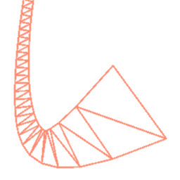

# Polyliner
</img>   

Adds 3D line/ribbon mesh capabilities. 
Supports Godot 4.1.

# Usage

The included `LinePath3D` node uses the `Path3D` node as a source of line segments;
you can use it to easily make a smooth line.

How to make a path?

Select the `LinePath3D`, then hold Ctrl (Cmd if on a Mac) and click to create points. 
To add handles to a point, hold Shift and click-and-drag on a point to add curve handles to it.

 

The included `Line3D` node more or less behaves like the stock `Line2D`. 
Push your line points to it and a line mesh will be automatically generated.

The included `Trail3D` node forms a trail. This node will form line segments from
its previous positions. It works in global space, so it works as a child of another `Node3D`.

These nodes render lines in the same manner, and all support the same shaders.

Within `addons/godot-polyliner/shaders/` is a bunch of ready-made line shaders,
from a cylinder facsimile to a full raymarched metal chain or swirling rope,
and from a blooming light tube to a swooshing effect.

(don't forget to make your shaders unique before editing them!)